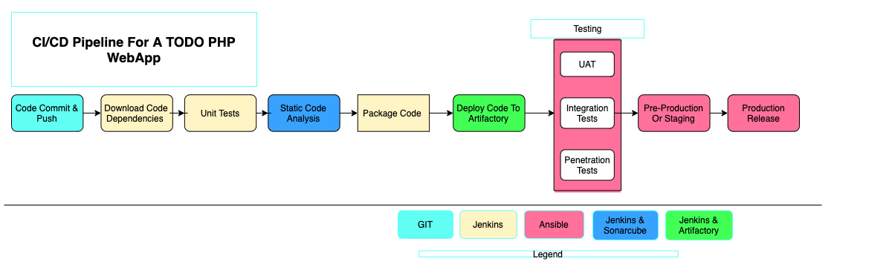
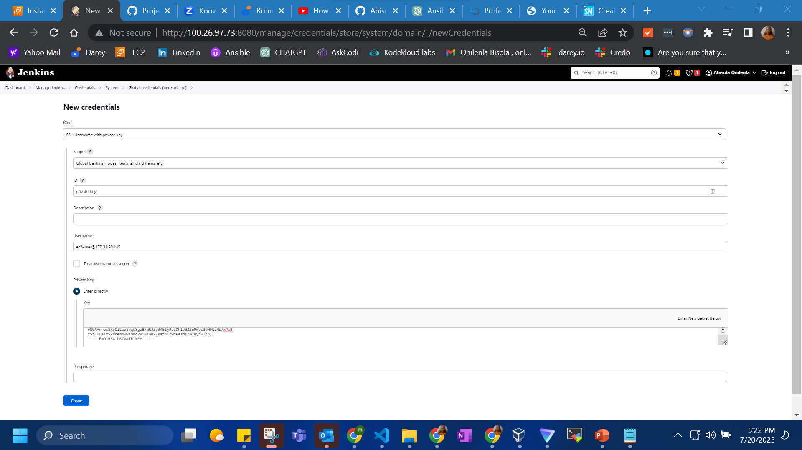

# Project 14
Experience Continuous Integration With Jenkins | Ansible | Artifactory | Sonarqube | PHP
In this project, you will understand and get hands on experience around the entire concept around CI/CD from applications perspective. To fully gain real expertise around this idea, it is best to see it in action across different programming languages and from the platform perspective too. From the application perspective, we will be focusing on PHP here; there are more projects ahead that are based on Java, Node.js, .Net and Python. By the time you start working on Terraform, Docker and Kubernetes projects, you will get to see the platform perspective of CI/CD in action.
To emphasize a typical CI Pipeline further, let us explore the diagram below.

- __Version Control:__ This is the stage where developers’ code gets committed and pushed after they have tested their work locally.
- __Build:__ Depending on the type of language or technology used, we may need to build the codes into binary executable files (in case of compiled languages) or just package the codes together with all necessary dependencies into a deployable package (in case of interpreted languages).
- __Unit Test:__ Unit tests that have been developed by the developers are tested. Depending on how the CI job is configured, the entire pipeline may fail if part of the tests fails, and developers will have to fix this failure before starting the pipeline again. A Job by the way, is a phase in the pipeline. Unit Test is a phase, therefore it can be considered a job on its own.
- __Deploy:__ Once the tests are passed, the next phase is to deploy the compiled or packaged code into an artifact repository. This is where all the various versions of code including the latest will be stored. The CI tool will have to pick up the code from this location to proceed with the remaining parts of the pipeline.
- __Auto Test:__ Apart from Unit testing, there are many other kinds of tests that are required to analyse the quality of code and determine how vulnerable the software will be to external or internal attacks. These tests must be automated, and there can be multiple environments created to fulfil different test requirements. For example, a server dedicated for Integration Testing will have the code deployed there to conduct integration tests. Once that passes, there can be other sub-layers in the testing phase in which the code will be deployed to, so as to conduct further tests. Such are User Acceptance Testing (UAT), and another can be Penetration Testing. These servers will be named according to what they have been designed to do in those environments. A UAT server is generally be used for UAT, SIT server is for Systems Integration Testing, PEN Server is for Penetration Testing and they can be named whatever the naming style or convention in which the team is used. An environment does not necessarily have to reside on one single server. In most cases it might be a stack as you have defined in your Ansible Inventory. All the servers in the inventory/dev are considered as Dev Environment. The same goes for inventory/stage (Staging Environment) inventory/preprod (Pre-production environment), inventory/prod (Production environment), etc. So, it is all down to naming convention as agreed and used company or team wide.
- __Deploy to production:__ Once all the tests have been conducted and either the release manager or whoever has the authority to authorize the release to the production server is happy, he gives green light to hit the deploy button to ship the release to production environment. This is an Ideal Continuous Delivery Pipeline. If the entire pipeline was automated and no human is required to manually give the Go decision, then this would be considered as Continuous Deployment. Because the cycle will be repeated, and every time there is a code commit and push, it causes the pipeline to trigger, and the loop continues over and over again.
- __Measure and Validate:__ This is where live users are interacting with the application and feedback is being collected for further improvements and bug fixes. 

In this project, I will be setting up a CI/CD Pipeline for a __PHP__ based application. The overall CI/CD process looks like the architecture below.

This project is architected in two major repositories with each repository containing its own CI/CD pipeline written in a Jenkinsfile

- __ansible-config-mgt__ Repository: This repository employs the use of Jenkinsfile to configure infrastructure required to carry out processes for our application to run using ansible roles.

- __PHP-todo__ Repository: This repository uses Jenkinsfile to run the processes needed to build the PHP application. These processes include testing, building, packaging and deploy.
  
For this project, i will be using __RHEL 8 and ubuntu 20.04 instances__. The tools we will be using to build, test, run code analysis, package and deploy our PHP application are Github, jenkins, Sonarqube and jfrog artifactory.

__CONFIGURING THE JENKINS SERVER FOR DEPLOYMENT__
step 1: We will configure our Jekins server.

step 2: connect to host:

step 3: Edit hostname

step 4: install Jenkins

step 5: install dependencies for java

step 6: update bash_profile

 
 step 7: start jenkins
 

 step 8: set up jenins and enable proximity
 

 step 9: Install & Open Blue Ocean Jenkins Plugin
 

 step 10: create access token
 

 step 11: select github and generate token
 

 step 12: create pipeline
 

 step 13: see newly created pipeline
 

 step 14: create jenkins file

 step 15: Build-configuration 

 step 16: push changes to git

 
 step 17: view build report on console output

 step 18: view UI build on blue ocean

 step 19: view build branch main report on blue ocean

 
 step 20: scan repo for new branch 
 

 step 21: Add a new stage for tests

 step 22 build testing step
 

 step 22: Add stage for deployment to cleanup
 

 step23: view build console on jenkins UI

step 24 view result on blueocean UI

step 25: 
Click on the ansible-config-mgt job and then click on "Administration" button to go back to the jenkins UI.

RUNNING ANSIBLE PLAYBOOK FROM JENKINS

Now that we have a broad overview of a typical Jenkins pipeline. Let us get the actual Ansible deployment to work.

We will be setting up database and nginx on two different instances using ansible playbook on jenkins UI.

Step 25: We will be setting up database and nginx on two different instances using ansible playbook on jenkins UI.

Step 26: Install ansible and it's dependencies.

Step 27: Installing Ansible plugin in Jenkins UI

Step  28: Then go to "global tool configuration" under "manage jenkins" to set up ansible plugin to work with jenkins

step 29:Creating Jenkinsfile to run the ansible playbook on jenkins.

Jenkins needs to export the ANSIBLE_CONFIG environment variable. You can put the ansible.cfg file alongside Jenkinsfile in the deploy directory. This way, anyone can easily identify that everything in there relates to deployment.

We need to set the credentials for ansible to be able to work with jenkins smoothly. To do this we go to manage credentials under manage jenkins.

STEP 30: Using the Pipeline Syntax tool in Ansible, generate the syntax to create environment variables to set.

step 31:
Then in the inventory/dev file, we update the IP address for our database and nginx.

step 32:
We set up roles for the database and nginx. The database roles will create a database - tooling and a database user - webaccess. We will go ahead and edit the _defaults/main.yml file in the mysql role.

step 33: set up playbook/site.yml

step 34: We push to github and then click on "scan repository now" the ansible-config-mgt on the jenikins UI. The ansible-config_mgt repository is scanned for any branch that has a Jenkinsfile and then builds.

step 35: PARAMETERIZING 'Jenkinsfile' FOR ANSIBLE DEPLOYMENT

To deploy to other environments, we will need to use parameters.

Update Jenkinsfile to introduce parameterization. Below is just one parameter. It has a default value in case if no value is specified at execution. It also has a description so that everyone is aware of its purpose.

In the Ansible execution section, remove the hardcoded inventory/dev and replace with '${inventory}'

